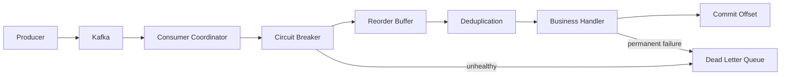
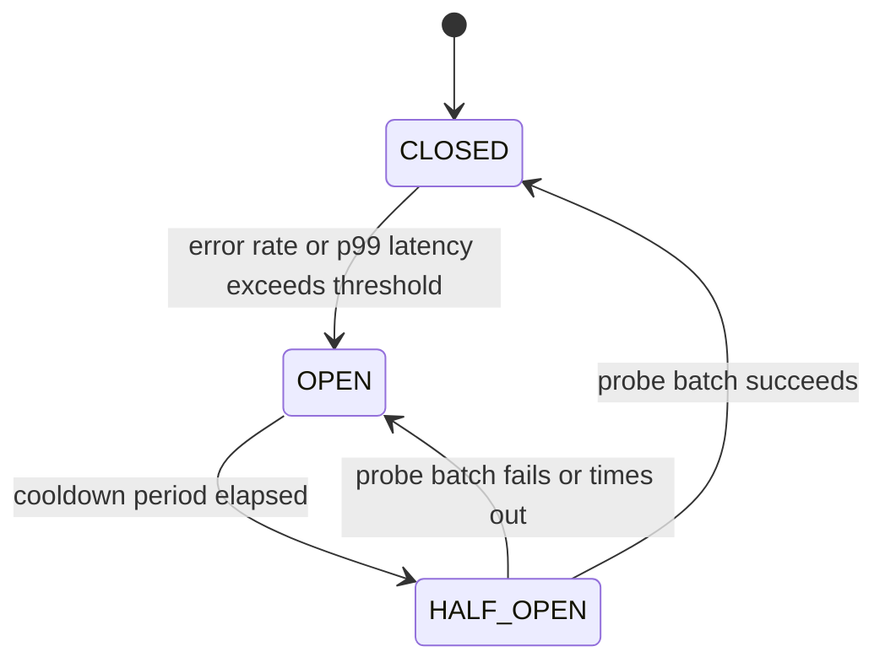

# Kafka Resilient Consumer Framework

A domain-generic Java library that isolates unhealthy Kafka partitions using per-partition circuit breakers while maintaining continuous processing of healthy partitions.

---

## Architecture



## Circuit Breaker State Machine



## Technology Stack

| Technology | Purpose |
|---|---|
| Java 17+ | Language (records, sealed interfaces, pattern matching) |
| Spring Boot 3.2 | Application framework and auto-configuration |
| Apache Kafka | Event streaming platform |
| Micrometer + Prometheus | Per-partition metrics and monitoring |
| Docker Compose | Local development environment |
| Testcontainers | Integration and benchmark testing |
| JUnit 5 | Unit and integration tests |
| Awaitility | Async test assertions |
| Gradle | Build tool (multi-module) |

## Module Structure

```
kafka-resilient-consumer/
├── framework/      # Zero domain knowledge — reusable library
├── demo/           # Sample payment-service exercising the framework
├── benchmarks/     # Performance harness with Testcontainers
└── docs/adr/       # Architecture Decision Records
```

| Module | Description |
|---|---|
| `framework/` | Reusable library with no domain knowledge. Contains coordinator, circuit breaker, reorder buffer, deduplication, DLQ router, and metrics components. |
| `demo/` | Sample payment-service that exercises the framework end-to-end with Docker Compose infrastructure. |
| `benchmarks/` | Performance harness using Testcontainers to measure throughput, latency, and recovery under controlled failure injection. |

## Quick Start

```bash
# Build
./gradlew build

# Run demo
cd demo && docker-compose up -d
./gradlew :demo:bootRun

# View metrics
open http://localhost:8080/actuator/prometheus
```

## Key Features

- **Per-partition circuit breakers** via Kafka `pause()`/`resume()`
- **Automatic recovery** with configurable cooldown and probe batches
- **Out-of-order event reordering** with bounded buffers and backpressure
- **Application-level deduplication** (not Kafka EOS — see [ADR-004](docs/adr/ADR-004-application-level-dedup-over-kafka-eos.md))
- **Classified DLQ routing** (deserialization, validation, transient, permanent)
- **Cooperative sticky rebalance** with state persistence and restoration
- **Batched offset commits** — accumulates per-partition offsets, commits once per poll batch (not per-record)
- **Per-partition Micrometer metrics** (Prometheus-compatible)
- **Structured JSON logging** with correlation IDs across all pipeline stages
- **Configuration validation at startup** — invalid values produce clear error messages

## Configuration Reference

| Property | Default | Description |
|---|---|---|
| `resilient.consumer.circuit-breaker.error-rate-threshold` | `0.5` | Error rate to trigger OPEN state (0.01–1.0) |
| `resilient.consumer.circuit-breaker.latency-threshold` | `5000ms` | p99 latency threshold (100ms–60000ms) |
| `resilient.consumer.circuit-breaker.cooldown-period` | `30s` | Time in OPEN before transitioning to HALF_OPEN (5s–300s) |
| `resilient.consumer.health-monitor.sliding-window-size` | `60s` | Health monitor sliding window duration (10s–300s) |
| `resilient.consumer.circuit-breaker.probe-batch-size` | `10` | Events consumed during HALF_OPEN probe |
| `resilient.consumer.reorder-buffer.reorder-timeout` | `5s` | Max wait time for out-of-order events (100ms–60s) |
| `resilient.consumer.reorder-buffer.max-buffer-size` | `10000` | Max buffered events per partition (100–1000000) |
| `resilient.consumer.deduplication.retention-period` | `72h` | Idempotency key retention period (24h–168h) |
| `resilient.consumer.dlq.max-retry-count` | `3` | Retries before DLQ routing (1–10) |
| `resilient.consumer.shutdown-timeout` | `30s` | Graceful shutdown timeout (5s–120s) |

All properties are validated at startup — invalid values produce clear error messages and prevent the application from starting.

## Extension Points

| Interface | Purpose |
|---|---|
| `EventHandler<T>` | Inject business logic — implement to process events with your domain logic |
| `EventDeserializer<T>` | Convert raw `ConsumerRecord` bytes into `SequencedEvent<T>` with source entity and sequence number |
| `IdempotencyKeyStore` | Plug in an external deduplication store (default: in-memory; Redis implementation included) |
| `StateStore` | Plug in persistent state backend (default: file-based JSON; Redis implementation included) |

## Architecture Decision Records

All ADRs are located in [`docs/adr/`](docs/adr/):

| ADR | Decision |
|---|---|
| [ADR-001](docs/adr/ADR-001-pause-resume-over-custom-isolation.md) | Why pause()/resume() over custom isolation |
| [ADR-002](docs/adr/ADR-002-per-partition-circuit-breakers.md) | Why per-partition circuit breakers |
| [ADR-003](docs/adr/ADR-003-reorder-before-business-logic.md) | Why reorder before business logic |
| [ADR-004](docs/adr/ADR-004-application-level-dedup-over-kafka-eos.md) | Why application-level deduplication over Kafka EOS |
| [ADR-005](docs/adr/ADR-005-cooperative-sticky-rebalance.md) | Why cooperative sticky rebalance |
| [ADR-006](docs/adr/ADR-006-dlq-error-classification.md) | Why DLQ error classification |
| [ADR-007](docs/adr/ADR-007-single-threaded-poll-loop.md) | Why single-threaded poll loop over thread-per-partition |
| [ADR-008](docs/adr/ADR-008-redis-for-cross-instance-state.md) | Why Redis for cross-instance state sharing |

## Benchmarks

See [`BENCHMARKS.md`](BENCHMARKS.md) for full results with 95% confidence intervals.

The benchmarking harness uses Testcontainers with a 6-partition Kafka cluster and measures:

| Metric | Result |
|--------|--------|
| Baseline throughput | ~12,400 events/sec |
| Throughput degradation (2/6 isolated) | ~35% (linear) |
| Recovery time (OPEN → CLOSED) | ~31.2s ± 0.8s |
| Reorder latency (p50 / p99) | 0.02ms / 48.7ms |
| Dedup latency (p50 / p99) | 0.001ms / 0.008ms |
| Rebalance duration | ~4.2s ± 1.1s |
| DLQ routing throughput | ~9,800 events/sec |
| Memory per buffered event | ~340 bytes |

## License

[MIT](LICENSE)
